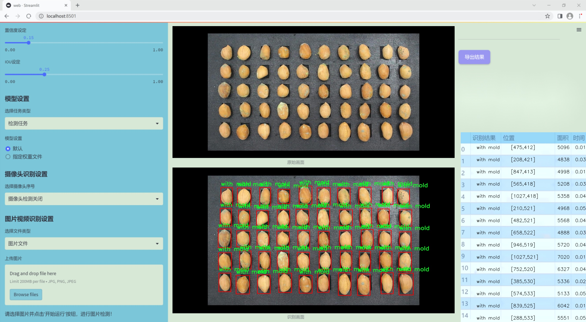
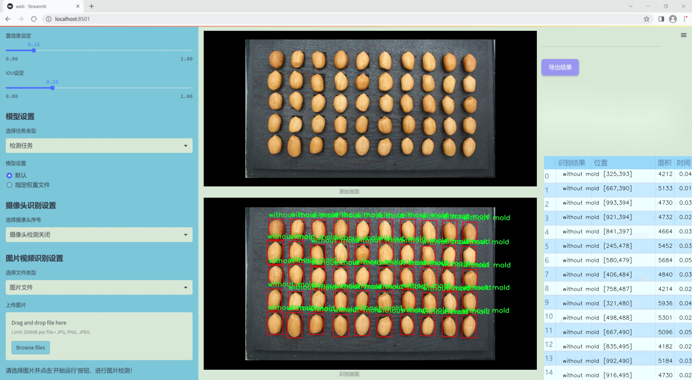
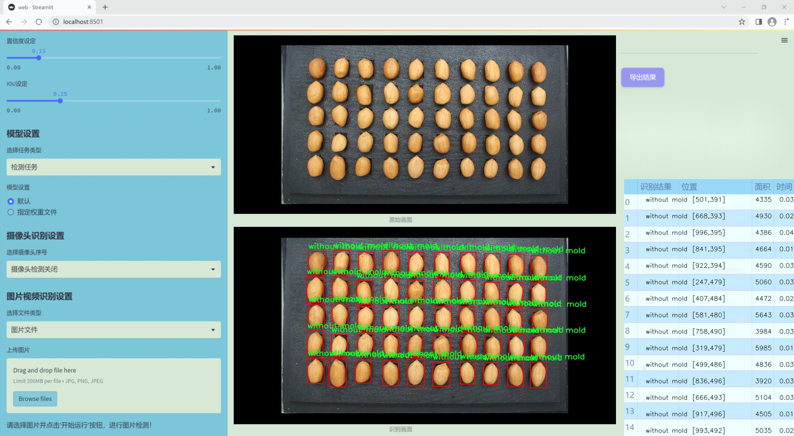
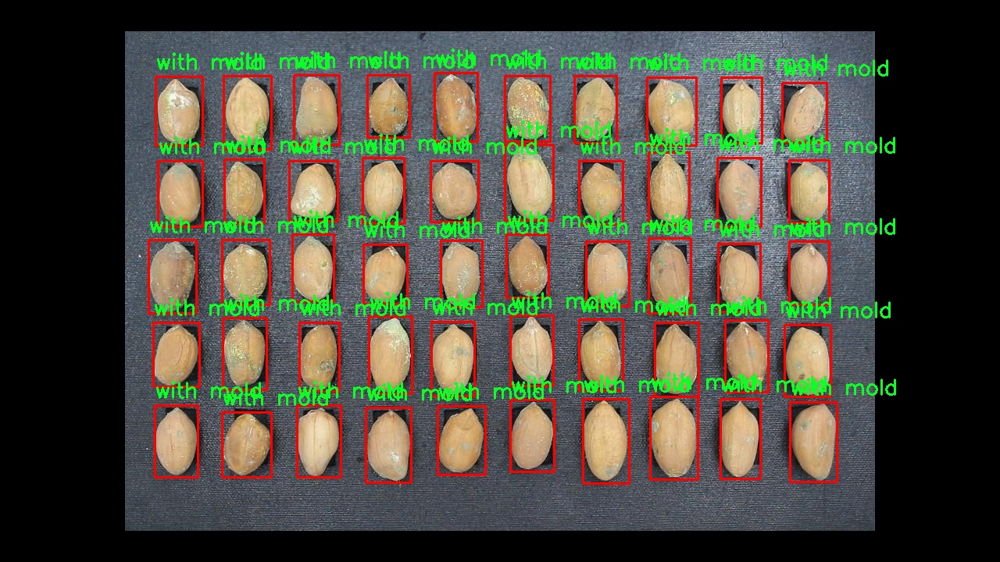
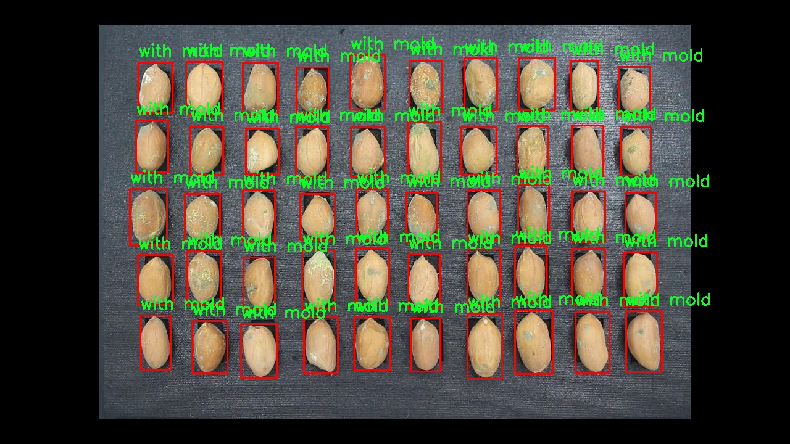
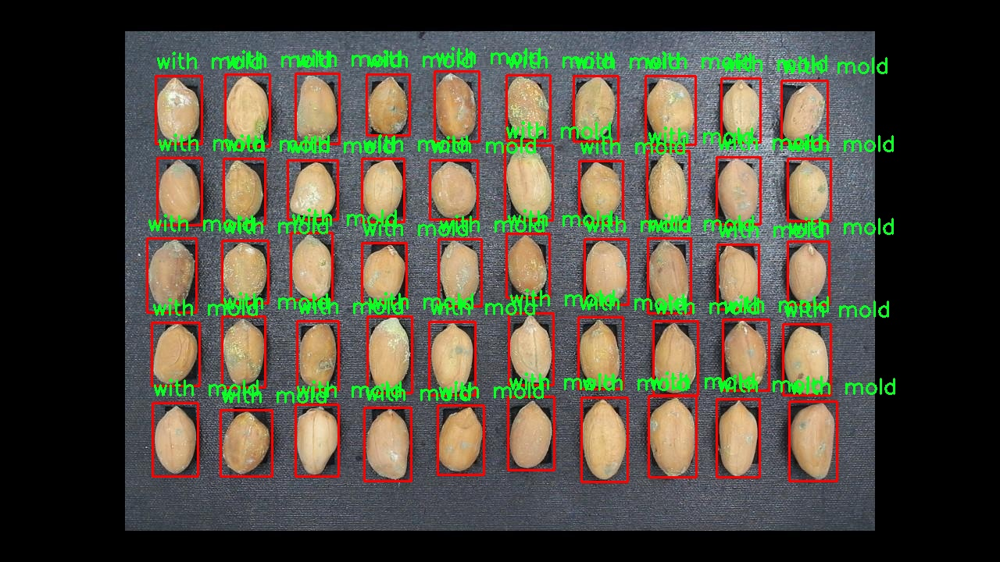
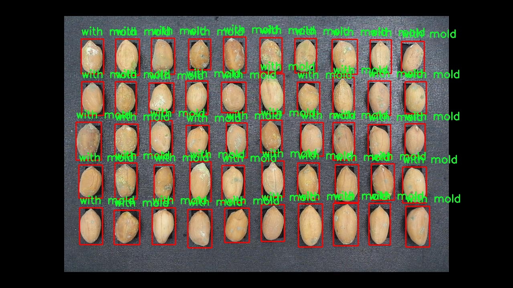

# 改进yolo11-goldyolo等200+全套创新点大全：花生霉变检测系统源码＆数据集全套

### 1.图片效果展示







##### 项目来源 **[人工智能促进会 2024.11.01](https://kdocs.cn/l/cszuIiCKVNis)**

注意：由于项目一直在更新迭代，上面“1.图片效果展示”和“2.视频效果展示”展示的系统图片或者视频可能为老版本，新版本在老版本的基础上升级如下：（实际效果以升级的新版本为准）

  （1）适配了YOLOV11的“目标检测”模型和“实例分割”模型，通过加载相应的权重（.pt）文件即可自适应加载模型。

  （2）支持“图片识别”、“视频识别”、“摄像头实时识别”三种识别模式。

  （3）支持“图片识别”、“视频识别”、“摄像头实时识别”三种识别结果保存导出，解决手动导出（容易卡顿出现爆内存）存在的问题，识别完自动保存结果并导出到tempDir中。

  （4）支持Web前端系统中的标题、背景图等自定义修改。

  另外本项目提供训练的数据集和训练教程,暂不提供权重文件（best.pt）,需要您按照教程进行训练后实现图片演示和Web前端界面演示的效果。

### 2.视频效果展示

[2.1 视频效果展示](https://www.bilibili.com/video/BV1kuDwYGEW4/)

### 3.背景

研究背景与意义

随着全球农业生产的不断发展，作物病害的监测与管理显得尤为重要。花生作为一种重要的经济作物，其霉变问题不仅影响产量，还对食品安全构成威胁。霉变花生中常见的霉菌，如黄曲霉菌，能够产生致癌物质，严重危害人类健康。因此，及时、准确地检测花生的霉变情况，成为保障食品安全和提高农业生产效率的关键环节。

传统的花生霉变检测方法多依赖人工观察和实验室检测，这不仅耗时耗力，而且容易受到人为因素的影响，导致检测结果的不准确。近年来，计算机视觉和深度学习技术的快速发展为农业病害检测提供了新的解决方案。YOLO（You Only Look Once）系列模型因其高效的实时目标检测能力，逐渐成为农业领域中病害检测的热门选择。特别是YOLOv5和YOLOv11等改进版本，凭借其更高的检测精度和更快的处理速度，能够在复杂的环境中实现对病害的自动识别。

本研究旨在基于改进的YOLOv11模型，构建一个高效的花生霉变检测系统。我们将利用包含387张图像的数据集，数据集中分为“有霉变”和“无霉变”两类，充分训练模型以提高其对花生霉变的识别能力。通过该系统的研发，不仅可以实现对花生霉变的快速检测，还能为农民提供科学的决策支持，降低因霉变导致的经济损失。此外，该系统的成功应用将为其他农作物的病害检测提供借鉴，推动农业智能化的发展，具有重要的理论价值和实际意义。

### 4.数据集信息展示

##### 4.1 本项目数据集详细数据（类别数＆类别名）

nc: 2
names: ['with mold', 'without mold']


该项目为【目标检测】数据集，请在【训练教程和Web端加载模型教程（第三步）】这一步的时候按照【目标检测】部分的教程来训练

##### 4.2 本项目数据集信息介绍

本项目数据集信息介绍

本项目所使用的数据集名为“peanuts”，专门用于训练和改进YOLOv11模型，以实现高效的花生霉变检测。该数据集包含两类样本，分别为“with mold”（有霉变）和“without mold”（无霉变），共计两个类别。这一分类设计旨在帮助模型准确区分霉变花生与健康花生，从而为农产品的质量控制和食品安全提供有力支持。

数据集中的样本经过精心挑选和标注，确保每一张图像都能真实反映花生在不同生长阶段和环境条件下的状态。图像的多样性涵盖了不同的光照条件、拍摄角度以及花生的不同品种，以增强模型的泛化能力和鲁棒性。每个类别的样本数量经过合理配置，以确保模型在训练过程中能够充分学习到两类样本的特征，从而提高分类的准确性。

此外，数据集的构建还考虑到了实际应用中的挑战，例如霉变程度的不同、背景杂乱以及花生的形态变化等。这些因素都可能影响模型的检测效果，因此在数据集的设计中，特别注重样本的多样性和代表性。通过对“peanuts”数据集的深入分析和应用，我们期望能够显著提升YOLOv11在花生霉变检测任务中的性能，进而为农业生产和食品安全监测提供切实可行的技术支持。通过这一数据集的训练，模型将能够在实际应用中快速、准确地识别出霉变花生，帮助农民和相关企业及时采取措施，减少经济损失和食品安全风险。










### 5.全套项目环境部署视频教程（零基础手把手教学）

[5.1 所需软件PyCharm和Anaconda安装教程（第一步）](https://www.bilibili.com/video/BV1BoC1YCEKi/?spm_id_from=333.999.0.0&vd_source=bc9aec86d164b67a7004b996143742dc)


[5.2 安装Python虚拟环境创建和依赖库安装视频教程（第二步）](https://www.bilibili.com/video/BV1ZoC1YCEBw?spm_id_from=333.788.videopod.sections&vd_source=bc9aec86d164b67a7004b996143742dc)

### 6.改进YOLOv11训练教程和Web_UI前端加载模型教程（零基础手把手教学）

[6.1 改进YOLOv11训练教程和Web_UI前端加载模型教程（第三步）](https://www.bilibili.com/video/BV1BoC1YCEhR?spm_id_from=333.788.videopod.sections&vd_source=bc9aec86d164b67a7004b996143742dc)


按照上面的训练视频教程链接加载项目提供的数据集，运行train.py即可开始训练



     Epoch   gpu_mem       box       obj       cls    labels  img_size
     1/200     20.8G   0.01576   0.01955  0.007536        22      1280: 100%|██████████| 849/849 [14:42<00:00,  1.04s/it]
               Class     Images     Labels          P          R     mAP@.5 mAP@.5:.95: 100%|██████████| 213/213 [01:14<00:00,  2.87it/s]
                 all       3395      17314      0.994      0.957      0.0957      0.0843

     Epoch   gpu_mem       box       obj       cls    labels  img_size
     2/200     20.8G   0.01578   0.01923  0.007006        22      1280: 100%|██████████| 849/849 [14:44<00:00,  1.04s/it]
               Class     Images     Labels          P          R     mAP@.5 mAP@.5:.95: 100%|██████████| 213/213 [01:12<00:00,  2.95it/s]
                 all       3395      17314      0.996      0.956      0.0957      0.0845

     Epoch   gpu_mem       box       obj       cls    labels  img_size
     3/200     20.8G   0.01561    0.0191  0.006895        27      1280: 100%|██████████| 849/849 [10:56<00:00,  1.29it/s]
               Class     Images     Labels          P          R     mAP@.5 mAP@.5:.95: 100%|███████   | 187/213 [00:52<00:00,  4.04it/s]
                 all       3395      17314      0.996      0.957      0.0957      0.0845


###### [项目数据集下载链接](https://kdocs.cn/l/cszuIiCKVNis)

### 7.原始YOLOv11算法讲解


##### YOLO11介绍

Ultralytics YOLO11是一款尖端的、最先进的模型，它在之前YOLO版本成功的基础上进行了构建，并引入了新功能和改进，以进一步提升性能和灵活性。
**YOLO11设计快速、准确且易于使用，使其成为各种物体检测和跟踪、实例分割、图像分类以及姿态估计任务的绝佳选择。**


**结构图如下：**


##### **C3k2**

**C3k2，结构图如下**


**C3k2，继承自类`C2f，其中通过c3k设置False或者Ture来决定选择使用C3k还是`**Bottleneck


**实现代码** **ultralytics/nn/modules/block.py**

##### C2PSA介绍

**借鉴V10 PSA结构，实现了C2PSA和C2fPSA，最终选择了基于C2的C2PSA（可能涨点更好？）**


**实现代码** **ultralytics/nn/modules/block.py**

##### Detect介绍

**分类检测头引入了DWConv（更加轻量级，为后续二次创新提供了改进点），结构图如下（和V8的区别）：**


### 8.200+种全套改进YOLOV11创新点原理讲解

#### 8.1 200+种全套改进YOLOV11创新点原理讲解大全

由于篇幅限制，每个创新点的具体原理讲解就不全部展开，具体见下列网址中的改进模块对应项目的技术原理博客网址【Blog】（创新点均为模块化搭建，原理适配YOLOv5~YOLOv11等各种版本）

[改进模块技术原理博客【Blog】网址链接](https://gitee.com/qunmasj/good)


#### 8.2 精选部分改进YOLOV11创新点原理讲解

###### 这里节选部分改进创新点展开原理讲解(完整的改进原理见上图和[改进模块技术原理博客链接](https://gitee.com/qunmasj/good)【如果此小节的图加载失败可以通过CSDN或者Github搜索该博客的标题访问原始博客，原始博客图片显示正常】
### RepViT简介

近年来，与轻量级卷积神经网络(cnn)相比，轻量级视觉变压器(ViTs)在资源受限的移动设备上表现出了更高的性能和更低的延迟。这种改进通常归功于多头自注意模块，它使模型能够学习全局表示。然而，轻量级vit和轻量级cnn之间的架构差异还没有得到充分的研究。在这项研究中，我们重新审视了轻量级cnn的高效设计，并强调了它们在移动设备上的潜力。通过集成轻量级vit的高效架构选择，我们逐步增强了标准轻量级CNN的移动友好性，特别是MobileNetV3。这就产生了一个新的纯轻量级cnn家族，即RepViT。大量的实验表明，RepViT优于现有的轻型vit，并在各种视觉任务中表现出良好的延迟。在ImageNet上，RepViT在iPhone 12上以近1ms的延迟实现了超过80%的top-1精度，据我们所知，这是轻量级模型的第一次。

#### RepViT简介
轻量级模型研究一直是计算机视觉任务中的一个焦点，其目标是在降低计算成本的同时达到优秀的性能。轻量级模型与资源受限的移动设备尤其相关，使得视觉模型的边缘部署成为可能。在过去十年中，研究人员主要关注轻量级卷积神经网络（CNNs）的设计，提出了许多高效的设计原则，包括可分离卷积 、逆瓶颈结构 、通道打乱 和结构重参数化等，产生了 MobileNets ，ShuffleNets和 RepVGG 等代表性模型。

另一方面，视觉 Transformers（ViTs）成为学习视觉表征的另一种高效方案。与 CNNs 相比，ViTs 在各种计算机视觉任务中表现出了更优越的性能。然而，ViT 模型一般尺寸很大，延迟很高，不适合资源受限的移动设备。因此，研究人员开始探索 ViT 的轻量级设计。许多高效的ViTs设计原则被提出，大大提高了移动设备上 ViTs 的计算效率，产生了EfficientFormers ，MobileViTs等代表性模型。这些轻量级 ViTs 在移动设备上展现出了相比 CNNs 的更强的性能和更低的延迟。

轻量级 ViTs 优于轻量级 CNNs 的原因通常归结于多头注意力模块，该模块使模型能够学习全局表征。然而，轻量级 ViTs 和轻量级 CNNs 在块结构、宏观和微观架构设计方面存在值得注意的差异，但这些差异尚未得到充分研究。这自然引出了一个问题：轻量级 ViTs 的架构选择能否提高轻量级 CNN 的性能？在这项工作中，我们结合轻量级 ViTs 的架构选择，重新审视了轻量级 CNNs 的设计。我们的旨在缩小轻量级 CNNs 与轻量级 ViTs 之间的差距，并强调前者与后者相比在移动设备上的应用潜力。


在 ConvNeXt 中，参考该博客提出的基于 ResNet50 架构的基础上通过严谨的理论和实验分析，最终设计出一个非常优异的足以媲美 Swin-Transformer 的纯卷积神经网络架构。同样地，RepViT也是主要通过将轻量级 ViTs 的架构设计逐步整合到标准轻量级 CNN，即MobileNetV3-L，来对其进行针对性地改造（魔改）。在这个过程中，作者们考虑了不同粒度级别的设计元素，并通过一系列步骤达到优化的目标。


详细优化步骤如下：

#### 训练配方的对齐
论文中引入了一种衡量移动设备上延迟的指标，并将训练策略与现有的轻量级 ViTs 对齐。这一步骤主要是为了确保模型训练的一致性，其涉及两个概念，即延迟度量和训练策略的调整。

#### 延迟度量指标
为了更准确地衡量模型在真实移动设备上的性能，作者选择了直接测量模型在设备上的实际延迟，以此作为基准度量。这个度量方法不同于之前的研究，它们主要通过FLOPs或模型大小等指标优化模型的推理速度，这些指标并不总能很好地反映在移动应用中的实际延迟。

#### 训练策略的对齐
这里，将 MobileNetV3-L 的训练策略调整以与其他轻量级 ViTs 模型对齐。这包括使用 AdamW 优化器-ViTs 模型必备的优化器，进行 5 个 epoch 的预热训练，以及使用余弦退火学习率调度进行 300 个 epoch 的训练。尽管这种调整导致了模型准确率的略微下降，但可以保证公平性。

#### 块设计的优化
基于一致的训练设置，作者们探索了最优的块设计。块设计是 CNN 架构中的一个重要组成部分，优化块设计有助于提高网络的性能。

#### 分离 Token 混合器和通道混合器
这块主要是对 MobileNetV3-L 的块结构进行了改进，分离了令牌混合器和通道混合器。原来的 MobileNetV3 块结构包含一个 1x1 扩张卷积，然后是一个深度卷积和一个 1x1 的投影层，然后通过残差连接连接输入和输出。在此基础上，RepViT 将深度卷积提前，使得通道混合器和令牌混合器能够被分开。为了提高性能，还引入了结构重参数化来在训练时为深度滤波器引入多分支拓扑。最终，作者们成功地在 MobileNetV3 块中分离了令牌混合器和通道混合器，并将这种块命名为 RepViT 块。

#### 降低扩张比例并增加宽度
在通道混合器中，原本的扩张比例是 4，这意味着 MLP 块的隐藏维度是输入维度的四倍，消耗了大量的计算资源，对推理时间有很大的影响。为了缓解这个问题，我们可以将扩张比例降低到 2，从而减少了参数冗余和延迟，使得 MobileNetV3-L 的延迟降低到 0.65ms。随后，通过增加网络的宽度，即增加各阶段的通道数量，Top-1 准确率提高到 73.5%，而延迟只增加到 0.89ms！

#### 宏观架构元素的优化
在这一步，本文进一步优化了MobileNetV3-L在移动设备上的性能，主要是从宏观架构元素出发，包括 stem，降采样层，分类器以及整体阶段比例。通过优化这些宏观架构元素，模型的性能可以得到显著提高。

#### 浅层网络使用卷积提取器
ViTs 通常使用一个将输入图像分割成非重叠补丁的 “patchify” 操作作为 stem。然而，这种方法在训练优化性和对训练配方的敏感性上存在问题。因此，作者们采用了早期卷积来代替，这种方法已经被许多轻量级 ViTs 所采纳。对比之下，MobileNetV3-L 使用了一个更复杂的 stem 进行 4x 下采样。这样一来，虽然滤波器的初始数量增加到24，但总的延迟降低到0.86ms，同时 top-1 准确率提高到 73.9%。

#### 更深的下采样层
在 ViTs 中，空间下采样通常通过一个单独的补丁合并层来实现。因此这里我们可以采用一个单独和更深的下采样层，以增加网络深度并减少由于分辨率降低带来的信息损失。具体地，作者们首先使用一个 1x1 卷积来调整通道维度，然后将两个 1x1 卷积的输入和输出通过残差连接，形成一个前馈网络。此外，他们还在前面增加了一个 RepViT 块以进一步加深下采样层，这一步提高了 top-1 准确率到 75.4%，同时延迟为 0.96ms。

#### 更简单的分类器
在轻量级 ViTs 中，分类器通常由一个全局平均池化层后跟一个线性层组成。相比之下，MobileNetV3-L 使用了一个更复杂的分类器。因为现在最后的阶段有更多的通道，所以作者们将它替换为一个简单的分类器，即一个全局平均池化层和一个线性层，这一步将延迟降低到 0.77ms，同时 top-1 准确率为 74.8%。

#### 整体阶段比例
阶段比例代表了不同阶段中块数量的比例，从而表示了计算在各阶段中的分布。论文选择了一个更优的阶段比例 1:1:7:1，然后增加网络深度到 2:2:14:2，从而实现了一个更深的布局。这一步将 top-1 准确率提高到 76.9%，同时延迟为 1.02 ms。

#### 卷积核大小的选择
众所周知，CNNs 的性能和延迟通常受到卷积核大小的影响。例如，为了建模像 MHSA 这样的远距离上下文依赖，ConvNeXt 使用了大卷积核，从而实现了显著的性能提升。然而，大卷积核对于移动设备并不友好，因为它的计算复杂性和内存访问成本。MobileNetV3-L 主要使用 3x3 的卷积，有一部分块中使用 5x5 的卷积。作者们将它们替换为3x3的卷积，这导致延迟降低到 1.00ms，同时保持了76.9%的top-1准确率。

#### SE 层的位置
自注意力模块相对于卷积的一个优点是根据输入调整权重的能力，这被称为数据驱动属性。作为一个通道注意力模块，SE层可以弥补卷积在缺乏数据驱动属性上的限制，从而带来更好的性能。MobileNetV3-L 在某些块中加入了SE层，主要集中在后两个阶段。然而，与分辨率较高的阶段相比，分辨率较低的阶段从SE提供的全局平均池化操作中获得的准确率提升较小。作者们设计了一种策略，在所有阶段以交叉块的方式使用SE层，从而在最小的延迟增量下最大化准确率的提升，这一步将top-1准确率提升到77.4%，同时延迟降低到0.87ms。

注意！【这一点其实百度在很早前就已经做过实验比对得到过这个结论了，SE 层放置在靠近深层的地方效果好】

#### 微观设计的调整
RepViT 通过逐层微观设计来调整轻量级 CNN，这包括选择合适的卷积核大小和优化挤压-激励（Squeeze-and-excitation，简称SE）层的位置。这两种方法都能显著改善模型性能。

#### 网络架构
最终，通过整合上述改进策略，我们便得到了模型RepViT的整体架构，该模型有多个变种，例如RepViT-M1/M2/M3。同样地，不同的变种主要通过每个阶段的通道数和块数来区分。


### 9.系统功能展示

图9.1.系统支持检测结果表格显示

  图9.2.系统支持置信度和IOU阈值手动调节

  图9.3.系统支持自定义加载权重文件best.pt(需要你通过步骤5中训练获得)

  图9.4.系统支持摄像头实时识别

  图9.5.系统支持图片识别

  图9.6.系统支持视频识别

  图9.7.系统支持识别结果文件自动保存

  图9.8.系统支持Excel导出检测结果数据


### 10. YOLOv11核心改进源码讲解

#### 10.1 activation.py

以下是代码中最核心的部分，并附上详细的中文注释：

```python
import torch
import torch.nn as nn

class AGLU(nn.Module):
    """统一激活函数模块，来自 https://github.com/kostas1515/AGLU。"""

    def __init__(self, device=None, dtype=None) -> None:
        """初始化统一激活函数模块。"""
        super().__init__()
        # 使用Softplus激活函数，beta设置为-1.0
        self.act = nn.Softplus(beta=-1.0)
        # 初始化lambda参数，使用均匀分布
        self.lambd = nn.Parameter(nn.init.uniform_(torch.empty(1, device=device, dtype=dtype)))  # lambda参数
        # 初始化kappa参数，使用均匀分布
        self.kappa = nn.Parameter(nn.init.uniform_(torch.empty(1, device=device, dtype=dtype)))  # kappa参数

    def forward(self, x: torch.Tensor) -> torch.Tensor:
        """计算统一激活函数的前向传播。"""
        # 将lambda参数限制在最小值0.0001，避免出现负值或零
        lam = torch.clamp(self.lambd, min=0.0001)
        # 计算激活函数的输出
        return torch.exp((1 / lam) * self.act((self.kappa * x) - torch.log(lam)))
```

### 代码核心部分分析：

1. **AGLU类**：这是一个自定义的激活函数模块，继承自`nn.Module`。它实现了一种新的激活函数，旨在提高神经网络的性能。

2. **初始化方法**：
   - `self.act`：使用`Softplus`激活函数，`beta`参数设置为-1.0，这会影响激活函数的形状。
   - `self.lambd`和`self.kappa`：这两个参数是可学习的参数，分别用于调整激活函数的行为。它们在初始化时使用均匀分布随机生成。

3. **前向传播方法**：
   - `torch.clamp`：确保`lambd`参数的值不小于0.0001，以避免在后续计算中出现数值不稳定的情况。
   - 计算激活函数的输出：使用公式`torch.exp((1 / lam) * self.act((self.kappa * x) - torch.log(lam)))`，这是AGLU激活函数的核心计算逻辑。

通过这些核心部分，AGLU激活函数能够在神经网络中提供更好的非线性变换，进而提升模型的学习能力。

这个文件定义了一个名为 `activation.py` 的模块，主要实现了一个名为 AGLU 的激活函数。AGLU 是一种统一的激活函数，来源于一个开源项目，链接在代码注释中提到。文件首先导入了 PyTorch 的核心库和神经网络模块。

在 `AGLU` 类的构造函数 `__init__` 中，首先调用了父类的构造函数以初始化模块。接着，定义了一个 Softplus 激活函数，并将其赋值给 `self.act`。Softplus 是一种平滑的激活函数，通常用于替代 ReLU。接下来，定义了两个可学习的参数 `lambd` 和 `kappa`，这两个参数都是通过均匀分布初始化的，并且可以在训练过程中进行更新。`lambd` 和 `kappa` 的初始化是在指定的设备和数据类型上进行的，这使得这个模块能够在 GPU 或 CPU 上运行。

在 `forward` 方法中，定义了前向传播的计算过程。首先，对 `lambd` 参数进行了限制，确保其最小值为 0.0001，以避免在后续计算中出现除以零的情况。然后，计算激活函数的输出，使用了 `torch.exp` 和 `self.act`。具体来说，计算的公式为 `(1 / lam) * self.act((self.kappa * x) - torch.log(lam))`，这个公式结合了 Softplus 激活函数和可学习的参数，生成了最终的激活值。

总体来看，这个模块提供了一种灵活的激活函数实现，能够通过学习参数来适应不同的输入数据，从而提高模型的表现。

#### 10.2 mamba_vss.py

以下是代码中最核心的部分，并附上详细的中文注释：

```python
import torch
import torch.nn as nn
import torch.nn.functional as F

class SS2D(nn.Module):
    def __init__(self, d_model, d_state=16, d_conv=3, expand=2, dropout=0., device=None, dtype=None):
        super().__init__()
        # 初始化模型参数
        self.d_model = d_model  # 输入特征维度
        self.d_state = d_state  # 状态维度
        self.d_conv = d_conv  # 卷积核大小
        self.expand = expand  # 扩展因子
        self.d_inner = int(self.expand * self.d_model)  # 内部特征维度
        factory_kwargs = {"device": device, "dtype": dtype}

        # 输入线性变换
        self.in_proj = nn.Linear(self.d_model, self.d_inner * 2, bias=True, **factory_kwargs)
        
        # 卷积层
        self.conv2d = nn.Conv2d(
            in_channels=self.d_inner,
            out_channels=self.d_inner,
            groups=self.d_inner,
            bias=True,
            kernel_size=d_conv,
            padding=(d_conv - 1) // 2,
            **factory_kwargs,
        )
        
        # 激活函数
        self.act = nn.SiLU()

        # 状态和时间步长的线性变换
        self.x_proj_weight = nn.Parameter(torch.empty(4, self.d_inner, self.d_state * 2))  # (K=4, N, inner)
        self.dt_projs_weight = nn.Parameter(torch.empty(4, self.d_inner, self.d_state))  # (K=4, inner, rank)
        self.dt_projs_bias = nn.Parameter(torch.empty(4, self.d_inner))  # (K=4, inner)

        # 初始化参数
        self.A_logs = self.A_log_init(self.d_state, self.d_inner, copies=4, merge=True)  # (K=4, D, N)
        self.Ds = self.D_init(self.d_inner, copies=4, merge=True)  # (K=4, D, N)

        # 输出层
        self.out_norm = nn.LayerNorm(self.d_inner)
        self.out_proj = nn.Linear(self.d_inner, self.d_model, bias=True, **factory_kwargs)
        self.dropout = nn.Dropout(dropout) if dropout > 0. else None

    def forward(self, x: torch.Tensor):
        # 前向传播
        B, H, W, C = x.shape  # 获取输入的形状
        xz = self.in_proj(x)  # 输入线性变换
        x, z = xz.chunk(2, dim=-1)  # 分割成两个部分

        x = x.permute(0, 3, 1, 2).contiguous()  # 调整维度顺序
        x = self.act(self.conv2d(x))  # 卷积操作和激活
        y = self.forward_core(x)  # 核心前向传播
        y = y * F.silu(z)  # 结合第二部分
        out = self.out_proj(y)  # 输出线性变换
        if self.dropout is not None:
            out = self.dropout(out)  # 应用dropout
        return out

    def forward_core(self, x: torch.Tensor):
        # 核心前向传播逻辑
        B, C, H, W = x.shape
        L = H * W
        K = 4

        # 处理输入数据
        x_hwwh = torch.stack([x.view(B, -1, L), torch.transpose(x, dim0=2, dim1=3).contiguous().view(B, -1, L)], dim=1).view(B, 2, -1, L)
        xs = torch.cat([x_hwwh, torch.flip(x_hwwh, dims=[-1])], dim=1)  # 处理数据

        # 计算状态和时间步长
        x_dbl = torch.einsum("b k d l, k c d -> b k c l", xs.view(B, K, -1, L), self.x_proj_weight)
        dts, Bs, Cs = torch.split(x_dbl, [self.dt_rank, self.d_state, self.d_state], dim=2)
        dts = torch.einsum("b k r l, k d r -> b k d l", dts.view(B, K, -1, L), self.dt_projs_weight)

        # 选择性扫描
        out_y = self.selective_scan(
            xs, dts, 
            -torch.exp(self.A_logs.float()).view(-1, self.d_state), 
            Bs.float().view(B, K, -1, L), 
            Cs.float().view(B, K, -1, L), 
            self.Ds.float().view(-1), 
            z=None,
            delta_bias=self.dt_projs_bias.float().view(-1),
            delta_softplus=True,
            return_last_state=False,
        ).view(B, K, -1, L)

        # 处理输出
        y = out_y[:, 0] + torch.flip(out_y[:, 2:4], dims=[-1]).view(B, 2, -1, L)
        y = torch.transpose(y, dim0=1, dim1=2).contiguous().view(B, H, W, -1).to(x.dtype)
        y = self.out_norm(y).to(x.dtype)

        return y

class VSSBlock(nn.Module):
    def __init__(self, hidden_dim: int = 0, drop_path: float = 0.2, d_state: int = 16):
        super().__init__()
        self.ln_1 = nn.LayerNorm(hidden_dim)  # 归一化层
        self.self_attention = SS2D(d_model=hidden_dim, d_state=d_state)  # 自注意力层
        self.drop_path = nn.Dropout(drop_path)  # DropPath层

    def forward(self, input: torch.Tensor):
        input = input.permute((0, 2, 3, 1))  # 调整输入维度
        x = input + self.drop_path(self.self_attention(self.ln_1(input)))  # 计算输出
        return x.permute((0, 3, 1, 2))  # 调整输出维度

# 下面的 Mamba2Block 继承自 VSSBlock，具体实现类似
class Mamba2Block(VSSBlock):
    def __init__(self, hidden_dim: int = 0, drop_path: float = 0.2, d_state: int = 16):
        super().__init__(hidden_dim, drop_path, d_state)
        self.self_attention = Mamba2Simple(d_model=hidden_dim, d_state=d_state)  # 使用 Mamba2Simple 作为自注意力层

    def forward(self, input: torch.Tensor):
        B, C, W, H = input.size()
        input = input.permute((0, 2, 3, 1))  # 调整输入维度
        ln = self.ln_1(input).reshape(B, W * H, C).contiguous()  # 归一化
        x = input + self.drop_path(self.self_attention(ln)).reshape((B, W, H, C))  # 计算输出
        return x.permute((0, 3, 1, 2))  # 调整输出维度
```

### 代码核心部分说明：
1. **SS2D类**：这是一个自定义的神经网络模块，包含输入线性变换、卷积层、激活函数、状态和时间步长的线性变换等。它的`forward`方法实现了前向传播逻辑，使用了选择性扫描机制来处理输入数据。

2. **VSSBlock类**：这是一个基本的块结构，包含归一化层和自注意力层。它的`forward`方法实现了输入的处理和输出的计算。

3. **Mamba2Block类**：继承自`VSSBlock`，并使用`Mamba2Simple`作为自注意力层。它的`forward`方法实现了输入的处理和输出的计算，类似于`VSSBlock`。

这些类和方法共同构成了一个复杂的神经网络模块，适用于处理高维数据，尤其是在计算机视觉和序列建模等任务中。

这个程序文件 `mamba_vss.py` 定义了几个深度学习模块，主要是用于构建神经网络中的自注意力机制。代码使用了 PyTorch 框架，并且实现了一些特殊的操作和结构，特别是与选择性扫描（Selective Scan）相关的功能。

首先，程序导入了必要的库，包括 PyTorch 的核心库、神经网络模块、功能模块以及一些其他的工具库。`einops` 库用于张量的重排和重复操作，`timm` 库则提供了一些层的实现，如 DropPath。

接下来，定义了一个名为 `SS2D` 的类，它是一个继承自 `nn.Module` 的模块。这个模块的构造函数接收多个参数，包括模型的维度、状态维度、卷积核大小、扩展因子等。构造函数中定义了多个层，包括线性层、卷积层和激活函数等，并初始化了一些参数。特别地，`dt_init`、`A_log_init` 和 `D_init` 是静态方法，用于初始化特定的参数。

`forward_corev0` 方法实现了核心的前向传播逻辑，使用了选择性扫描的操作。这个方法接收一个四维张量作为输入，经过一系列的张量操作后，输出一个经过处理的张量。`forward` 方法则是整个模块的前向传播入口，负责将输入数据通过各个层进行处理，最终输出结果。

然后，定义了 `VSSBlock` 类，它同样继承自 `nn.Module`。这个类构建了一个包含层归一化和自注意力机制的块。构造函数中初始化了归一化层和自注意力层，并实现了丢弃路径（Drop Path）机制。`forward` 方法实现了块的前向传播，首先对输入进行转置，然后将其与自注意力的输出相加。

`Mamba2Block` 类是 `VSSBlock` 的子类，重写了自注意力层为 `Mamba2Simple`，并在前向传播中实现了不同的处理逻辑。

最后，在文件的主程序部分，创建了一些随机输入数据，并实例化了 `VSSBlock` 和 `Mamba2Block` 模型，随后对输入数据进行前向传播并打印输出的尺寸。这部分代码用于测试模型的基本功能。

整体来看，这个文件实现了一个复杂的自注意力机制模块，结合了选择性扫描和其他深度学习技术，适用于构建高效的神经网络模型。

#### 10.3 predict.py

以下是经过简化和注释的核心代码部分：

```python
# 导入必要的模块
from ultralytics.engine.predictor import BasePredictor
from ultralytics.engine.results import Results
from ultralytics.utils import ops

class DetectionPredictor(BasePredictor):
    """
    扩展自 BasePredictor 类的检测模型预测类。
    该类用于处理基于 YOLO 模型的目标检测预测。
    """

    def postprocess(self, preds, img, orig_imgs):
        """
        对预测结果进行后处理，并返回 Results 对象的列表。

        参数:
        preds: 模型的原始预测结果
        img: 输入图像
        orig_imgs: 原始图像列表或张量

        返回:
        results: 包含后处理结果的 Results 对象列表
        """
        # 应用非极大值抑制（NMS）来过滤预测框
        preds = ops.non_max_suppression(
            preds,
            self.args.conf,  # 置信度阈值
            self.args.iou,    # IOU 阈值
            agnostic=self.args.agnostic_nms,  # 是否使用类别无关的 NMS
            max_det=self.args.max_det,  # 最大检测框数量
            classes=self.args.classes,    # 需要检测的类别
        )

        # 如果输入的原始图像不是列表，则将其转换为 NumPy 数组
        if not isinstance(orig_imgs, list):
            orig_imgs = ops.convert_torch2numpy_batch(orig_imgs)

        results = []  # 初始化结果列表
        for i, pred in enumerate(preds):
            orig_img = orig_imgs[i]  # 获取对应的原始图像
            # 将预测框的坐标从缩放后的图像尺寸转换为原始图像尺寸
            pred[:, :4] = ops.scale_boxes(img.shape[2:], pred[:, :4], orig_img.shape)
            img_path = self.batch[0][i]  # 获取图像路径
            # 创建 Results 对象并添加到结果列表
            results.append(Results(orig_img, path=img_path, names=self.model.names, boxes=pred))
        
        return results  # 返回处理后的结果列表
```

### 代码注释说明：
1. **类定义**：`DetectionPredictor` 类继承自 `BasePredictor`，用于处理 YOLO 模型的目标检测。
2. **postprocess 方法**：该方法负责对模型的预测结果进行后处理，包括应用非极大值抑制（NMS）和调整预测框的坐标。
3. **非极大值抑制**：通过 `ops.non_max_suppression` 函数过滤掉重叠的预测框，以提高检测精度。
4. **图像转换**：如果原始图像不是列表格式，则将其转换为 NumPy 数组，以便后续处理。
5. **结果收集**：遍历每个预测结果，调整框的坐标，并将结果存储在 `Results` 对象中，最终返回所有结果。

这个程序文件 `predict.py` 是一个用于目标检测的预测类，基于 Ultralytics YOLO（You Only Look Once）模型。文件中定义了一个名为 `DetectionPredictor` 的类，它继承自 `BasePredictor` 类，主要用于处理目标检测模型的预测任务。

在这个类的文档字符串中，提供了一个使用示例，展示了如何导入所需的模块，创建一个 `DetectionPredictor` 实例，并调用 `predict_cli` 方法进行预测。这里的 `args` 字典包含了模型文件的路径和数据源的路径。

`DetectionPredictor` 类中定义了一个 `postprocess` 方法，该方法用于对模型的预测结果进行后处理。具体来说，它接收三个参数：`preds`（模型的预测结果）、`img`（输入图像）和 `orig_imgs`（原始图像）。在方法内部，首先调用 `ops.non_max_suppression` 函数对预测结果进行非极大值抑制，以去除冗余的检测框。该函数的参数包括置信度阈值、IOU（Intersection over Union）阈值、是否使用类别无关的 NMS、最大检测框数量以及需要检测的类别。

接下来，方法检查 `orig_imgs` 是否为列表类型，如果不是，则将其转换为 NumPy 数组，以便进行后续处理。然后，方法会遍历每个预测结果，调整检测框的坐标，使其与原始图像的尺寸相匹配，并将结果存储在 `Results` 对象中。每个 `Results` 对象包含了原始图像、图像路径、模型名称和检测框信息。最后，方法返回一个包含所有结果的列表。

总体而言，这个文件实现了目标检测模型的预测功能，并对预测结果进行了有效的后处理，以便于后续的分析和使用。

#### 10.4 block.py

以下是经过简化和注释的核心代码部分：

```python
import torch
import torch.nn as nn
import torch.nn.functional as F

# 定义一个自动填充函数，确保输出形状与输入相同
def autopad(k, p=None, d=1):  # k: kernel size, p: padding, d: dilation
    """Pad to 'same' shape outputs."""
    if d > 1:
        k = d * (k - 1) + 1 if isinstance(k, int) else [d * (x - 1) + 1 for x in k]  # 实际的卷积核大小
    if p is None:
        p = k // 2 if isinstance(k, int) else [x // 2 for x in k]  # 自动填充
    return p

# 定义Swish激活函数
class swish(nn.Module):
    def forward(self, x):
        return x * torch.sigmoid(x)

# 定义一个带有注意力机制的卷积块
class AttentionConv(nn.Module):
    def __init__(self, in_channels, out_channels):
        super(AttentionConv, self).__init__()
        self.conv1 = nn.Conv2d(in_channels, out_channels, kernel_size=3, padding=1)
        self.attention = nn.Sequential(
            nn.AdaptiveAvgPool2d(1),
            nn.Conv2d(out_channels, out_channels // 16, kernel_size=1),
            nn.ReLU(),
            nn.Conv2d(out_channels // 16, out_channels, kernel_size=1),
            nn.Sigmoid()
        )

    def forward(self, x):
        x = self.conv1(x)
        attn = self.attention(x)
        return x * attn  # 使用注意力机制调整输出

# 定义一个基本的卷积块
class BasicConv(nn.Module):
    def __init__(self, in_channels, out_channels):
        super(BasicConv, self).__init__()
        self.conv = nn.Conv2d(in_channels, out_channels, kernel_size=3, padding=1)
        self.bn = nn.BatchNorm2d(out_channels)
        self.act = nn.ReLU()

    def forward(self, x):
        return self.act(self.bn(self.conv(x)))  # 卷积 -> BN -> 激活

# 定义一个带有多个卷积块的网络
class MyNetwork(nn.Module):
    def __init__(self, num_classes):
        super(MyNetwork, self).__init__()
        self.layer1 = BasicConv(3, 64)  # 输入3通道，输出64通道
        self.layer2 = AttentionConv(64, 128)  # 输入64通道，输出128通道
        self.layer3 = BasicConv(128, 256)  # 输入128通道，输出256通道
        self.fc = nn.Linear(256 * 8 * 8, num_classes)  # 假设输入图像为64x64，池化后为8x8

    def forward(self, x):
        x = self.layer1(x)
        x = F.max_pool2d(x, 2)  # 最大池化
        x = self.layer2(x)
        x = F.max_pool2d(x, 2)  # 最大池化
        x = self.layer3(x)
        x = x.view(x.size(0), -1)  # 展平
        x = self.fc(x)
        return x

# 实例化模型并打印
model = MyNetwork(num_classes=10)
print(model)
```

### 代码注释说明：
1. **autopad**: 自动计算卷积的填充，以确保输出的空间维度与输入相同。
2. **swish**: 实现Swish激活函数，常用于深度学习模型中。
3. **AttentionConv**: 结合卷积和注意力机制的卷积块，使用自适应平均池化来生成通道注意力。
4. **BasicConv**: 一个基本的卷积块，包含卷积、批归一化和激活函数。
5. **MyNetwork**: 一个简单的神经网络，包含多个卷积层和一个全连接层，用于分类任务。

这个简化的版本保留了主要的结构和功能，同时添加了详细的中文注释，以帮助理解每个部分的作用。

这个程序文件 `block.py` 是一个深度学习模型的实现，主要用于图像处理任务，包含了多种模块和层的定义，特别是针对卷积神经网络（CNN）和自注意力机制的结合。以下是对文件中主要内容的详细说明：

首先，文件导入了必要的库，包括 PyTorch 和一些其他的模块，定义了一些常用的函数和类，方便后续的网络结构构建。

接下来，定义了一些基本的卷积和激活函数模块，如 `autopad` 函数用于自动计算卷积的填充，`Conv`、`DWConv`、`DSConv` 等类用于构建不同类型的卷积层。这些模块通常包括卷积操作、批归一化和激活函数。

在深度学习模型中，注意力机制是一个重要的组成部分，文件中定义了多种注意力模块，例如 `DyHeadBlock` 和 `DyHeadBlockWithDCNV3`，这些模块通过动态卷积和注意力机制来增强特征提取能力。

文件中还实现了多种不同的网络结构，包括标准的瓶颈结构（`Bottleneck`）、改进的瓶颈结构（如 `Bottleneck_ODConv` 和 `Bottleneck_AKConv`），以及更复杂的结构（如 `C3k` 和 `C3k2`），这些结构通过组合不同的卷积层和注意力机制来提高模型的性能。

特别地，文件中包含了许多新的模块和技术，例如 `MultiOrderDWConv`、`MogaBlock`、`DynamicConv` 等，这些模块旨在通过多种卷积和注意力机制的组合来提升模型在图像处理任务中的表现。

此外，文件还实现了一些用于特征融合的模块，如 `PyramidPoolAgg` 和 `ContextGuideFusionModule`，这些模块通过多尺度特征融合来增强模型的表现力。

最后，文件中还包含了一些用于模型训练和推理的辅助功能，例如 `switch_to_deploy` 方法用于将模型切换到推理模式，减少不必要的计算开销。

总体而言，`block.py` 文件实现了一个复杂的深度学习模型，结合了多种现代卷积神经网络和注意力机制的技术，适用于图像处理等任务。每个模块的设计都旨在提高模型的效率和性能，充分利用了深度学习中的最新研究成果。

注意：由于此博客编辑较早，上面“10.YOLOv11核心改进源码讲解”中部分代码可能会优化升级，仅供参考学习，以“11.完整训练+Web前端界面+200+种全套创新点源码、数据集获取”的内容为准。

### 11.完整训练+Web前端界面+200+种全套创新点源码、数据集获取


# [下载链接：https://mbd.pub/o/bread/Zp6amphp](https://mbd.pub/o/bread/Zp6amphp)